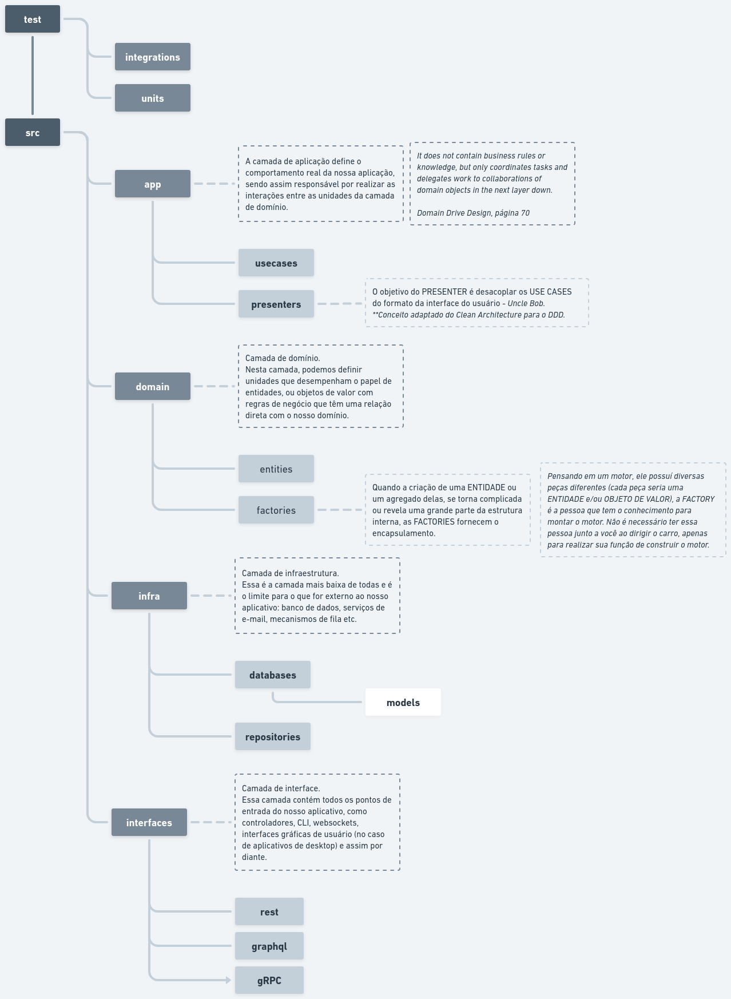

# VMY Users Crud
Aplicação de CRUD de usuários, desenvolvido em Golang 1.20 e MongoDB.  
Foram realizados testes de integração em todas as rotas e alguns testes unitários em arquivos pontais,
cobrindo a maioria dos casos.

### Design Tático (organização de pastas)
Foi utilizado conceitos do Domain Driven Design (DDD) para a organização do projeto.  
Segue abaixo um mapa que construi para representar o design tático utilizado:
  


## Para Executar
Antes de mais nada, crie um arquivo chamado ```.env``` na raiz do projeto com o seguinte formato:
```
PORT=8888
MONGODB_URI=mongodb://mongodb:27017 #Utilize "mongodb://localhost:27017" se optar por rodar a aplicação fora do docker.
MONGODB_DATABASE_NAME=vmytest

JWT_SALT_KEY=sadfkjaçsdj32
```  

Para executar o projeto é necessário ter o docker e docker compose instalados e executar o seguinte comando:
```
docker compose up --build
```

Ao iniciar o MongoDB pela primeira vez, é criado um usuário inicial para utilizar a aplicação.  
As credenciais são:
```
EMAIL = user@initial.com
PASSWORD = 123456
```

Os testes rodam com o seguinte comando:
```
go test -v -coverprofile cover.out ./...
go tool cover -html=cover.out -o cover.html
```
Abra o arquivo gerado ```cover.html``` no navegador para checar a cobertura.

# Endpoints
Arquivo para importar os endpoints no Postman [aqui](postman-collection.json).

### POST ```/sessions```
Cria uma sessão (login) e retorna o token de acesso para as rotas de usuário.  

**Body:**
```
{
    "email": "user@initial.com",
    "password": "123456"
}
```

### PUT ```/sessions/users/:id/passwords```
Atualiza o usuário inserindo uma senha para inicio de sessão.
Utilizada após a criação de usuário, essa rota seta uma senha para o usuário.  

**Body:**
```
{
    "password": "123456"
}
```
OBS.: O ideal é esse endpoint não utilizar o id do usuário, e sim um código aleatório com data de validade
sendo enviado por email após a criação do usuário. Porém, não foi possível implementar disparo de email.

### GET ```/users/:id```
Obtém usuário a partir do seu ID.
*É necessário enviar o token gerado em ```POST /sessions``` como Bearer Token.

### GET ```/users```
Obtém usuários. Possuí paginação.
*É necessário enviar o token gerado em ```POST /sessions``` como Bearer Token.  

**Querystring:**
```
limit= number opcional
offset= number opcional
```

### POST ```/users```
Cria usuário.
*É necessário enviar o token gerado em ```POST /sessions``` como Bearer Token.

**Body:**
```
{
    "name": "Nome Usuário",
    "email": "email@email.com",
    "birthDate": "2000-08-26",
    "address": {
        "street": "Rua quinta, 80",
        "city": "São Paulo",
        "state": "São Paulo",
        "country": "Brasil"
    }
}
```

### PATCH ```/users/:id```
Atualiza usuário a partir de seu ID.
*É necessário enviar o token gerado em ```POST /sessions``` como Bearer Token.  

**Body:**
```
{
    "name": "Nome Usuário"
}
```

### DELETE ```/users/:id```
Deleta usuário a partir de seu ID.
*É necessário enviar o token gerado em ```POST /sessions``` como Bearer Token.  

OBS.: É possível deletar o próprio usuário.
